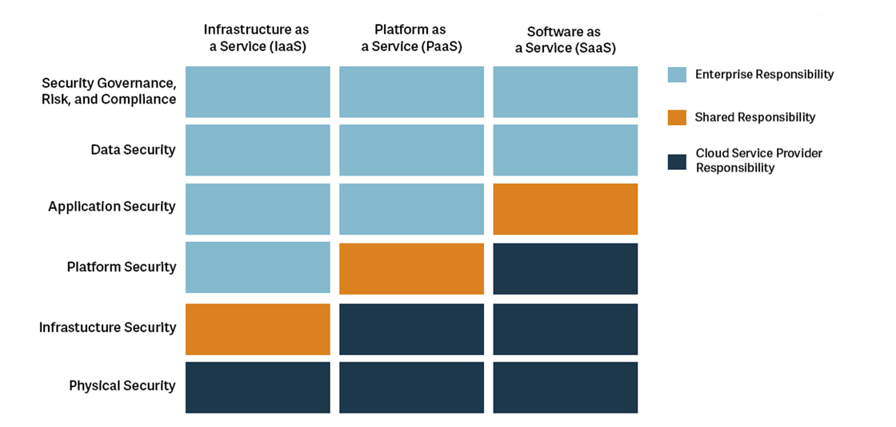

# What Is Cloud Computing

## Five Characteristics of Cloud Computing
1. On-demand self-service
2. Broad network access
3. Multitenancy and resource pooling
4. Rapid elasticity and scalability
5. Measure service

## Six Advantages of Cloud Computing
1. Trade capital expenses for operational expenses
2. Benefit from massive economies of scale
3. Stop guessing capacity
4. Increase speed and agility
5. Stop spending money running and maintaining data centers
6. Go global in minutes

## Problems Solved by the Cloud
* Flexibility
* Cost-effectiveness
* Scalability
* Elasticity
* High-availability and fault-tolerance
* Agility

## Types of Cloud Computing

### Infrastructure as a Service (IaaS)
* Provides hardware, networking, computers, data storage space
* Highest level of flexibility
* Easy to think like traditional on-premise IT
* Examples
  * AWS EC2
  * GCP, Azure, Rackspace, Digital Ocean, Linode

### Platform as a Service (PaaS)
* Remove the needs for your org to manage the underlying infrastructure
* Focus on the deployment and management of application
* Examples:
  * AWS Elastic Beanstalk
  * Heroku, Google App Engine (GCP), Windows Azure (MS)

### Software as a Service (SaaS)
* Completed product that ir run and managed by the service provider
  * Many AWS services (e.g., Rekognition for ML)
  * Google Apps (Gmail), Dropbox, Zoom

## Pricing
* AWS has 3 pricing fundamentals:
  1. Compute 
  2. Storage
  3. Data Transfer
    * Data transfer IN is free
    * Data transfer OUT is what you pay

### Shared Responsibilities

  
## AWS History
* 2002 (Launched internally)
* 2004 (Launched public)

## AWS Regions
* All around the world
  * us-east-1, eu-west-3, us-west-2 (Oregon) ...
* A region is a cluster of data centers
* Most AWS services are region-scoped

### How to Choose an AWS Region?
* Factors to consider
  * Compliance (data)
  * Proximity (reduce latency)
  * Available Services (some regions don't some services)
  * Pricing - varies from region to region

https://aws.amazon.com/about-aws/global-infrastructure/regions_az/

## AWS Availability Zones (AZ)
* Each region has availability zones
  * 3 min, 6 max, usually 3
  * Example:
    * ap-southeast-2
      * ap-southeast-2a, ap-southeast-2b, ap-southeast-2c
* Each availability zone has one or more data centers w/redundant power, networking, and connectivity
* Separate from each other, isolated from disasters
* All are connected with high bandwidth, ultra-low latency networking

## AWS Points of Presence (Edge Locations)
* Amazon has 216 Points of Presence
  * 205 edge locations
  * 11 regional caches
  * 84 cities
  * 42 countries
* Content is delivered to end users with lower latency

## References

